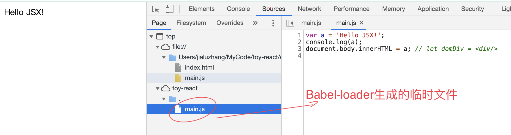
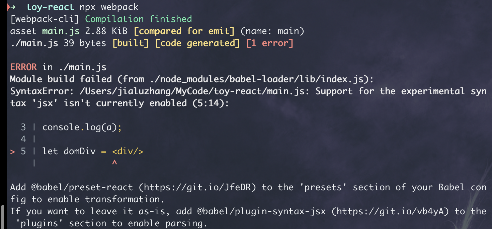
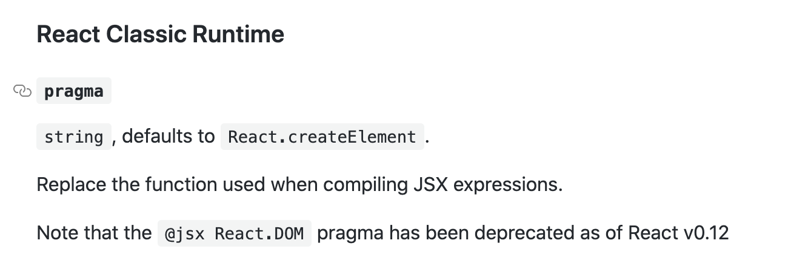
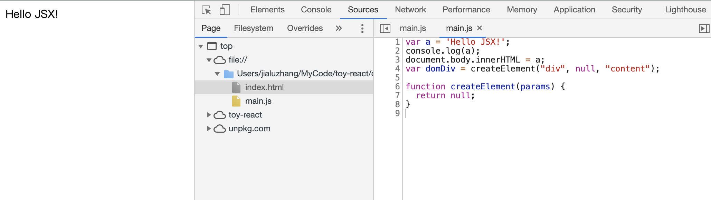
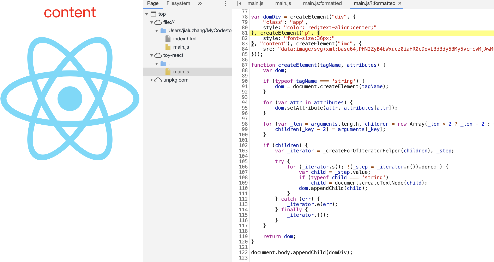
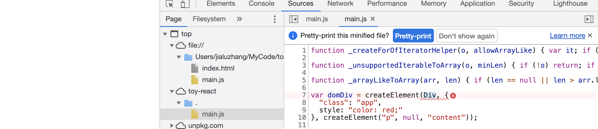

## JSX的原理和关键实现

### JSX基本原理

在安装完babel最基本的webpack相关插件后，已经能对es6语法进行必要的转换了。

**./main.js**

```js
let a = 'Hello JSX!';

console.log(a);
document.body.innerHTML = a;
// let domDiv = <div/>
```

**浏览器打开**



但仍然无法实现对jsx语法的转换。

**添加jsx语法**

```jsx
let domDiv = <div/>
```

**build报错**



可见，报错提示告诉我们两种解决方案：

+ 安装 `@babel/preset-react`

或

+ 安装[ `@babel/plugin-syntax-jsx` ](https://babeljs.io/docs/en/babel-plugin-syntax-jsx)

下面👇分别探究下两种配置的区别：

先从简单的开始，安装 `@babel/plugin-syntax-jsx` 

**配置**

```js
module.exports = {
    entry: {
        main: './main.js'
    },
    module: {
        rules: [
            {
                test: /\.js$/,
                use: {
                    loader: 'babel-loader',
                    options: {
                        "presets": ['@babel/preset-env'],
                        "plugins": ["@babel/plugin-syntax-jsx"]   // 配置@babel/plugin-syntax-jsx
                    }
                }
            }
        ]
    },
    mode: 'development'
}
```

**build**

```bash
➜  toy-react npx webpack
[webpack-cli] Compilation finished
asset main.js 1.1 KiB [emitted] (name: main)
./main.js 88 bytes [built] [code generated] [1 error]

ERROR in ./main.js 4:13
Module parse failed: Unexpected token (4:13)
File was processed with these loaders:
 * ./node_modules/babel-loader/lib/index.js
You may need an additional loader to handle the result of these loaders.
| console.log(a);
| document.body.innerHTML = a;
> var domDiv = <div />;

webpack 5.2.0 compiled with 1 error in 516 ms
```

真正的语法转换插件 **plugin-transform-react-jsx**

`npm install --save-dev @babel/plugin-transform-react-jsx`

**build**


可见plugin-transform-react-jsx的作用是将jsx语法转换为js语法。jsx语法 `<div />` 默认被转换成了一个React.create的函数调用，如果你项目中使用了React，上述的jsx语法最终就被渲染成了一个div标签。



我们也可以通过[设置插件参数](https://babeljs.io/docs/en/babel-plugin-transform-react-jsx#react-classic-runtime-1)自定义函数名称。

```js
module.exports = {
    entry: {
        main: './main.js'
    },
    module: {
        rules: [
            {
                test: /\.js$/,
                use: {
                    loader: 'babel-loader',
                    options: {
                        "presets": ['@babel/preset-env'],
                        "plugins": [
                            [
                                "@babel/plugin-transform-react-jsx", {
                                    pragma: 'createElement'
                                }
                            ]
                        ]
                    }
                }
            }
        ]
    },
    mode: 'development'
}
```

**build**



### 自定义createElement实现

#### 实现纯文本标签转换

```js
function createElement (tagName, attributes, ...children) {
    let dom;
    if (typeof tagName === 'string') {
        dom = document.createElement(tagName);
    }
    for (let attr in attributes) {
        dom.setAttribute(attr, attributes[attr]);
    }
    if (children) {
        for (let child of children) {
            if (typeof child === 'string')
                child = document.createTextNode(child);
            dom.appendChild(child)
        }
    }
    return dom;
}
```



实现纯文本标签转换函数。

一旦我们使用大写字母开头的标签名，会被认为是一个自定义的类。



但是一旦我们引入了自定义的类，就得重新改变其他普通dom元素的封装，`dom.appendChild(child)`

否则上述的dom和child都可能不是Dom元素，上述的句子必然会报错。

